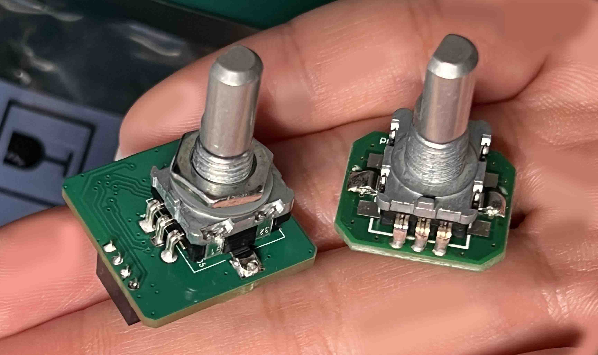

# KC901V-ENCODER

KC901V顶部的编码器手感十分屎，猜测它设计时仅采用了单边缘计数，另一个边只做了电平判断方向。所以在慢速左右转或者偶然回弹的时候，会有不自然的光标移动。

所以做了一个支持双边缘的编码器模块替换原装的编码器小板子，先让我嚼一遍编码器数据再喂给主板，优化手感与体验。

包含了硬件与软件。  
应该可以用于其他配置的相同外观的KC901x，新版的大约已经修复了相关的问题。

##  

  

与原小板比较
  
  

## 安装

替换原编码器位置，但是因为需要额外的3.3V供电，所以还需要一根飞线将主板的3.3V引上来。

这里使用了一根空中连接的1p杜邦线连接。

  
  
